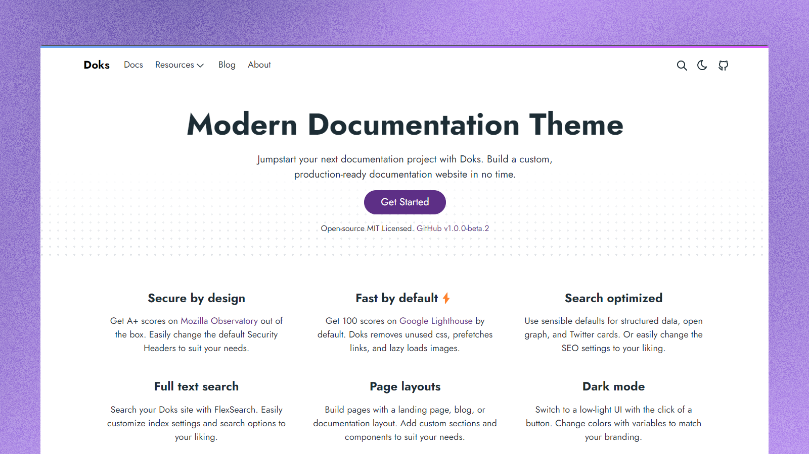

<p align="center">
  <br/>
  <a href="https://getdoks.org/">Doks</a> is a fast, flexible, and easy-to-use documentation theme built on <a href="https://gethyas.com/">Hyas</a> &mdash; 
  <br/>
  the all-in-one Hugo-npm framework.
  <br/><br/>
</p>

## Demo

- [doks.netlify.app](https://doks.netlify.app/)

## Key Features

- **Hugo powered:** Fast and flexible framework for building websites.
- **Project dependencies**: Install and update dependencies easier with [npm](https://www.npmjs.com/).
- **Production-ready**: Optimized for speed, SEO, and security.
- **Customizable:** Build the website you want with settings and integrations.
- **Development tools:** Check scripts, styles, and markdown for errors.
- **Deploy anywhere:** Deployment guides to different deployment services.

Check out our detailed [Why Doks](https://getdoks.org/concepts/why-doks/) breakdown to learn more about what makes Doks special. ✨

## Requirements

- [Node.js](https://nodejs.org/) — `v16.12.0` or higher

## Install

The recommended way to install the latest version of Doks is by running the command below:

```bash
npm create hyas@latest -- --template doks
```

Looking for help? Start with our [Getting Started](https://getdoks.org/docs/start-here/getting-started/) guide.

## Documentation

Visit our [official documentation](https://getdoks.org/).

## Support

Having trouble? Get help in the official [Doks Discussions](https://github.com/h-enk/doks/discussions).

## Contributing

New contributors welcome! Check out our [Contributor Guides](https://getdoks.org/contribute/) for help getting started.

## Links

- [License (MIT)](LICENSE)
- [Code of Conduct](https://github.com/gethyas/.github/blob/main/CODE_OF_CONDUCT.md)
- [Project Funding](.github/FUNDING.md)
- [Website](https://getdoks.org/)

## Sponsors

Doks is supported by Netlify, Algolia, and several other amazing organizations and inidviduals. [Sponsor Doks!](.github/FUNDING.md) ❤️
