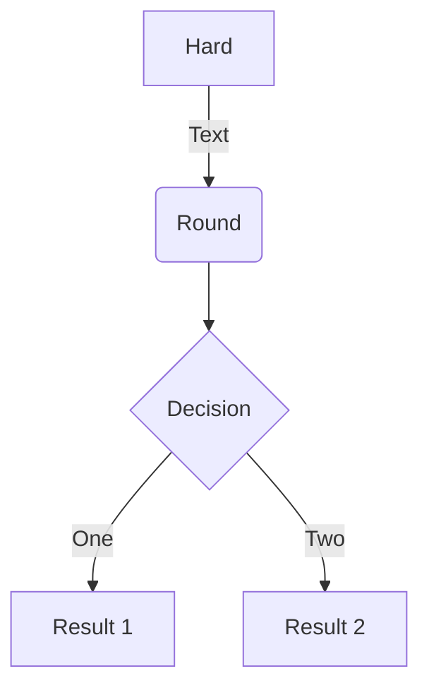
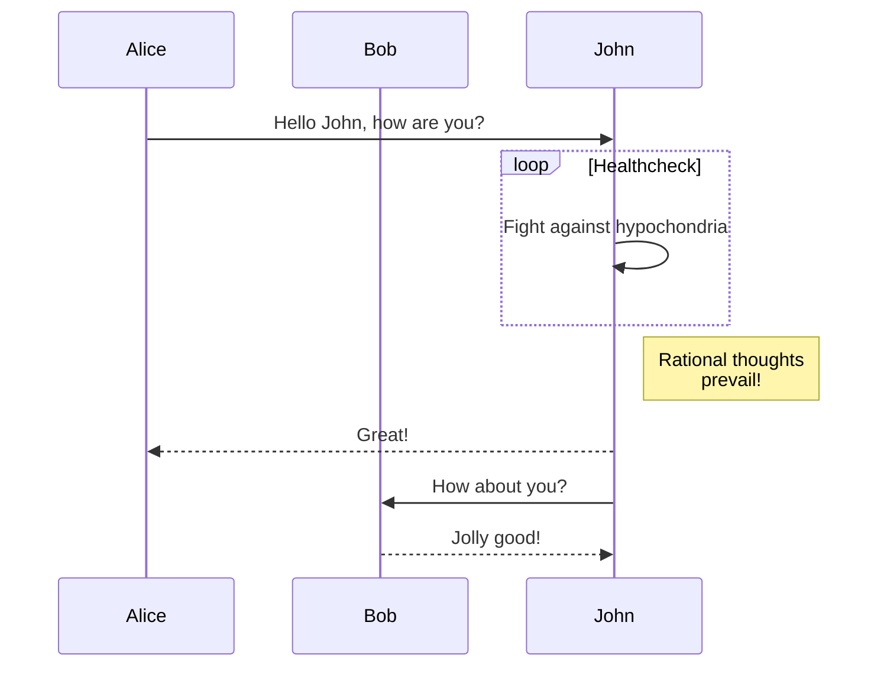

## GoAT

### Example 1

````md
```goat
      .               .                .               .--- 1          .-- 1     / 1
     / \              |                |           .---+            .-+         +
    /   \         .---+---.         .--+--.        |   '--- 2      |   '-- 2   / \ 2
   +     +        |       |        |       |    ---+            ---+          +
  / \   / \     .-+-.   .-+-.     .+.     .+.      |   .--- 3      |   .-- 3   \ / 3
 /   \ /   \    |   |   |   |    |   |   |   |     '---+            '-+         +
 1   2 3   4    1   2   3   4    1   2   3   4         '--- 4          '-- 4     \ 4

```
````

```goat
      .               .                .               .--- 1          .-- 1     / 1
     / \              |                |           .---+            .-+         +
    /   \         .---+---.         .--+--.        |   '--- 2      |   '-- 2   / \ 2
   +     +        |       |        |       |    ---+            ---+          +
  / \   / \     .-+-.   .-+-.     .+.     .+.      |   .--- 3      |   .-- 3   \ / 3
 /   \ /   \    |   |   |   |    |   |   |   |     '---+            '-+         +
 1   2 3   4    1   2   3   4    1   2   3   4         '--- 4          '-- 4     \ 4

```

### Example 2

````md
```goat
   .---.       .-.        .-.       .-.                                       .-.
   | A +----->| 1 +<---->| 2 |<----+ 4 +------------------.                  | 8 |
   '---'       '-'        '+'       '-'                    |                  '-'
                           |         ^                     |                   ^
                           v         |                     v                   |
                          .-.      .-+-.        .-.      .-+-.      .-.       .+.       .---.
                         | 3 +---->| B |<----->| 5 +---->| C +---->| 6 +---->| 7 |<---->| D |
                          '-'      '---'        '-'      '---'      '-'       '-'       '---'
```
````

```goat
   .---.       .-.        .-.       .-.                                       .-.
   | A +----->| 1 +<---->| 2 |<----+ 4 +------------------.                  | 8 |
   '---'       '-'        '+'       '-'                    |                  '-'
                           |         ^                     |                   ^
                           v         |                     v                   |
                          .-.      .-+-.        .-.      .-+-.      .-.       .+.       .---.
                         | 3 +---->| B |<----->| 5 +---->| C +---->| 6 +---->| 7 |<---->| D |
                          '-'      '---'        '-'      '---'      '-'       '-'       '---'
```

## Mermaid

### Example 1

````md

````

Renders into:


### Example 2

````md

````

Renders into:


## KaTeX

The default display mode delimiters are `$$` or `\\[` and `\\]`.

### Example 1

```md
$$\sum_{x=1}^5 y^z$$
```

Renders into:

$$\sum_{x=1}^5 y^z$$

### Example 2

```md
$$
\begin{equation*}
   n \sim  10^{18} \mathrm{cm^{-3}} \left(\frac{100\mathrm{km}}{R}\right)^2 \left(\frac{10\mathrm{MeV}}{\langle E \rangle}\right).
\end{equation*}
$$
```

Renders into:

$$
\begin{equation*}
   n \sim  10^{18} \mathrm{cm^{-3}} \left(\frac{100\mathrm{km}}{R}\right)^2 \left(\frac{10\mathrm{MeV}}{\langle E \rangle}\right).
\end{equation*}
$$

### Example 3

```md
\\[\int_a^b f(x)\\]
```

Renders into:

\\[\int_a^b f(x)\\]

### Example 4

Inline mode delimiters are `\\(` and `\\)`.

```md
Mass–energy relation: \\(E = mc^2\\)
```

Renders into:

Mass–energy relation: \\(E = mc^2\\)
