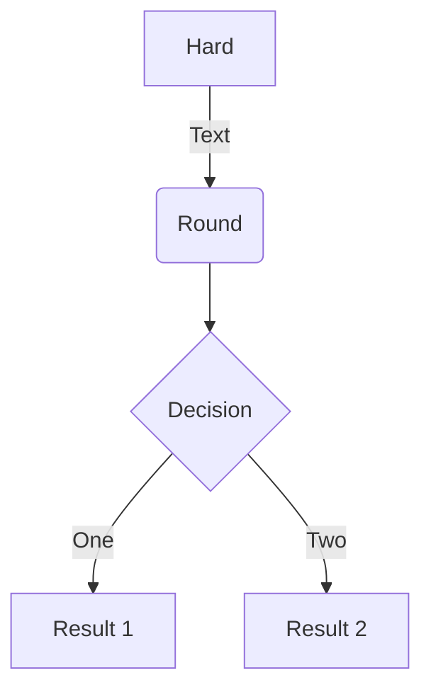
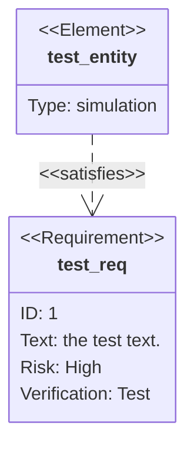

```js
function myFunction(p1, p2) {
  return p1 * p2;   // The function returns the product of p1 and p2
}
```

## Flowchart

### Shortcode

```md

graph TD
  A[Hard] -->|Text| B(Round)
  B --> C{Decision}
  C -->|One| D[Result 1]
  C -->|Two| E[Result 2]

```


graph TD
  A[Hard] -->|Text| B(Round)
  B --> C{Decision}
  C -->|One| D[Result 1]
  C -->|Two| E[Result 2]


### Code fences

````md

````


## Sequence diagram


sequenceDiagram
  Alice->>John: Hello John, how are you?
  loop Healthcheck
      John->>John: Fight against hypochondria
  end
  Note right of John: Rational thoughts!
  John-->>Alice: Great!
  John->>Bob: How about you?
  Bob-->>John: Jolly good!


## Class diagram


classDiagram
  Class01 <|-- AveryLongClass : Cool
  <<interface>> Class01
  Class09 --> C2 : Where am i?
  Class09 --* C3
  Class09 --|> Class07
  Class07 : equals()
  Class07 : Object[] elementData
  Class01 : size()
  Class01 : int chimp
  Class01 : int gorilla
  class Class10 {
    <<service>>
    int id
    size()
  }


## State diagram


stateDiagram-v2
  [*] --> Still
  Still --> [*]
  Still --> Moving
  Moving --> Still
  Moving --> Crash
  Crash --> [*]


## Entity Relationship Diagram


erDiagram
  CUSTOMER ||--o{ ORDER : places
  ORDER ||--|{ LINE-ITEM : contains
  CUSTOMER }|..|{ DELIVERY-ADDRESS : uses


## User Journey Diagram


journey
  title My working day
  section Go to work
    Make tea: 5: Me
    Go upstairs: 3: Me
    Do work: 1: Me, Cat
  section Go home
    Go downstairs: 5: Me
    Sit down: 3: Me


## Gantt chart


gantt
dateFormat  YYYY-MM-DD
title Adding GANTT diagram to mermaid
excludes weekdays 2014-01-10

section A section
Completed task            :done,    des1, 2014-01-06,2014-01-08
Active task               :active,  des2, 2014-01-09, 3d
Future task               :         des3, after des2, 5d
Future task2               :         des4, after des3, 5d


## Pie chart


pie
  title Key elements in Product X
  "Calcium" : 42.96
  "Potassium" : 50.05
  "Magnesium" : 10.01
  "Iron" :  5


## Requirement Diagram



## Requirements

Doks uses npm to centralize dependency management, making it [easy to update]() resources, build tooling, plugins, and build scripts:

- Download and install [Node.js](https://nodejs.org/) (it includes npm) for your platform.

## Start a new Doks project

Create a new site, change directories, install dependencies, and start development server.

### Create a new site

Doks is available as a child theme, and a starter theme:

- Use the Doks child theme, if you do __not__ plan to customize a lot, and/or need future Doks updates.
- Use the Doks starter theme, if you plan to customize a lot, and/or do __not__ need future Doks updates.

Not quite sure? Use the Doks child theme.

#### Doks child theme

```bash
git clone https://github.com/h-enk/doks-child-theme.git my-doks-site
```

#### Doks starter theme

```bash
git clone https://github.com/h-enk/doks.git my-doks-site
```

### Change directories

```bash
cd my-doks-site
```

### Install dependencies

```bash
npm install
```

### Start development server

```bash
npm run start
```

Doks will start the Hugo development webserver accessible by default at `http://localhost:1313`. Saved changes will live reload in the browser.

## Other commands

Doks comes with commands for common tasks. [Commands →]()
