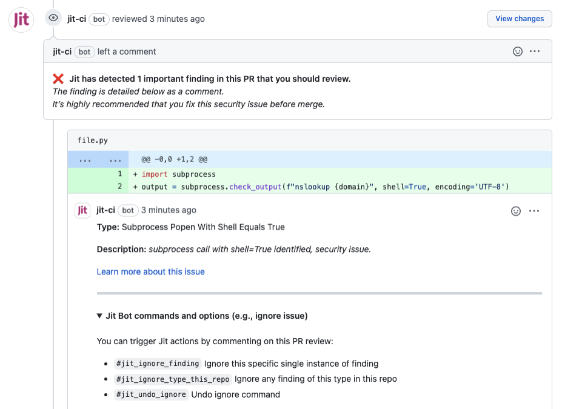

## Remote gif

```md

```


## Image in page bundle

```bash

```


## Screenshot in page bundle

```bash

```


## Image in assets directory

```bash

```


## Shortcode

### Image in page bundle

```md

```



### Image in assets directory

```md

```


